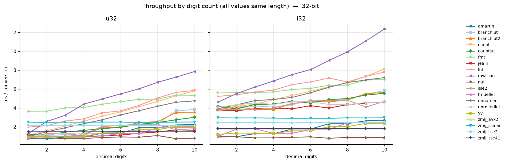
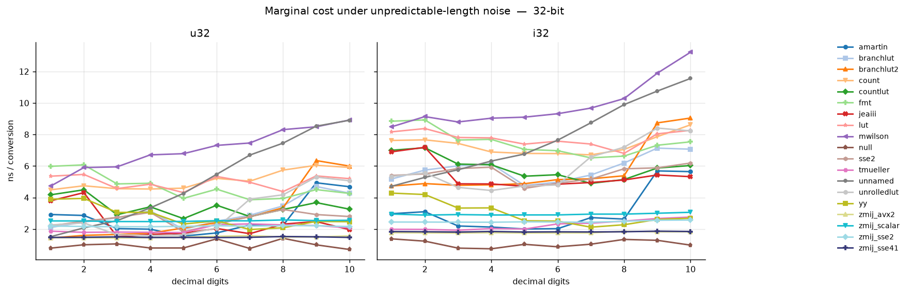
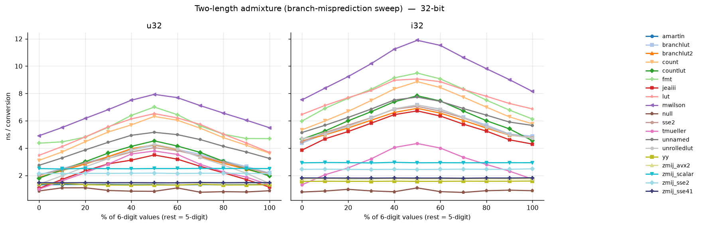
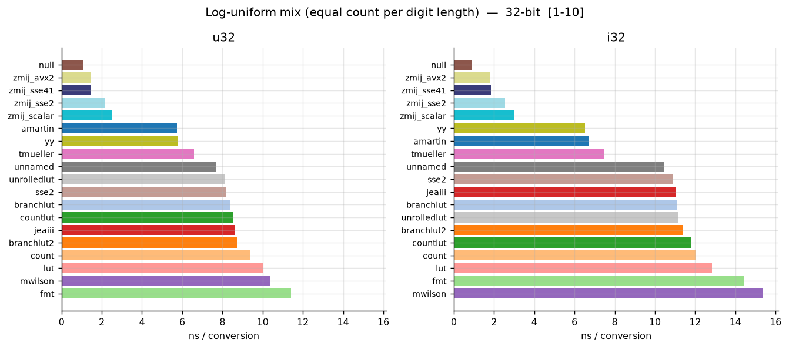
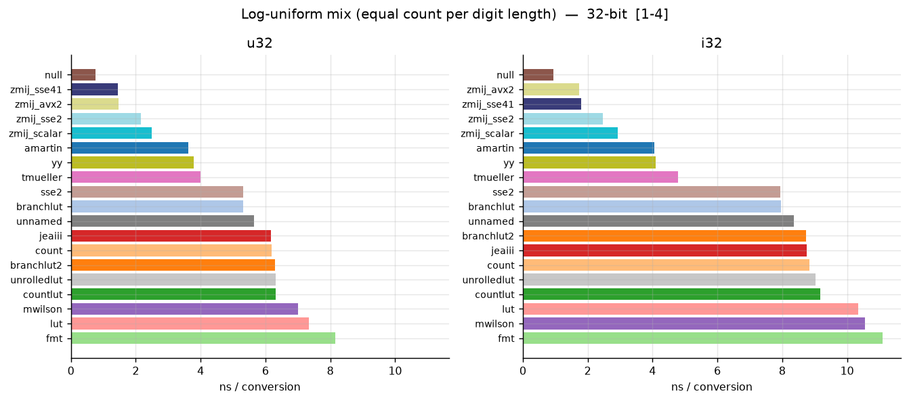
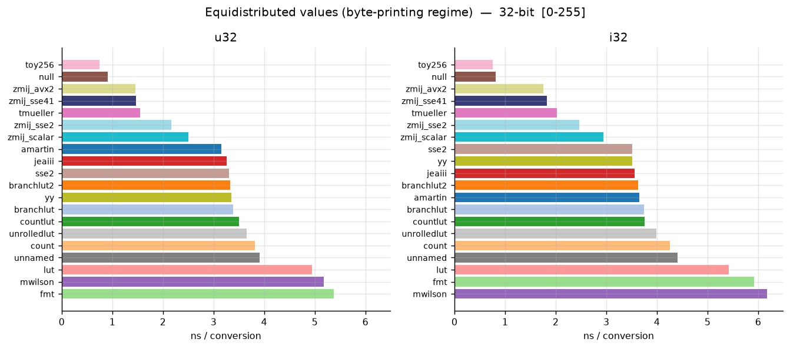
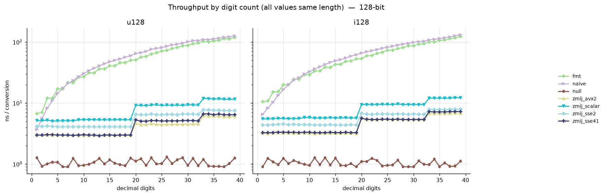

# itoa Benchmark

A fork of [Milo Yip's itoa-benchmark](https://github.com/miloyip/itoa-benchmark)
that was used to develop the **branch-free itoa algorithms** based on the BCD
(binary-coded decimal) conversion code found in
[zmij](https://github.com/vitaut/zmij).  On data with numbers of varying magnitude
these are the fastest codes that I am aware of.

The new entries appear in the roster four times — the same source
compiled once per x86-64 microarchitecture level: `zmij_scalar` (SIMD
disabled), `zmij_sse2`, `zmij_sse41`, and `zmij_avx2`. Notably, even the
non-SIMD `zmij_scalar` variant is competitive with the fastest branchy
implementations simply because branches are so expensive: on realistic
(mixed-length) data, what dominates is not arithmetic but branch
mispredictions.  The zmij algorithms have no branches and thus no
mispredictions.

Besides the new algorithms, this fork adds to the original benchmark:

* **Signed integers** (`i32`/`i64`/`i128`) benchmarked in parallel with the
  unsigned ones, so the cost of the sign handling is directly comparable.
* **128-bit integers** (`__int128`), see [below](#128-bit-support).
* **New benchmark modes** that control the digit-length distribution of the
  input — the heart of this fork, explained in the following sections.
* variable data sample length to study the impact of the large branch
  prediction buffers in CPUs
* An ABBA/interleaved measurement engine (each implementation is timed over
  the same dataset in alternating roster order, minimum over rounds) to cancel
  turbo/thermal drift.

All plots below were measured on an AMD Zen 5 core (g++-16); the full set,
including the 64-bit and 128-bit variants of each mode, is in
[result/plots_zen5](result/plots_zen5).

## The problem: benchmarking with perfect branch prediction

The original version of this benchmark ran an independent measurement for each
length: first a pass over nothing but 1-digit values, then a pass over
2-digit values, and so on. Within each pass every digit-count-related branch
always goes the same way, so the branch predictor is perfect. That is a fine
way to study an algorithm's arithmetic, but it does not reflect the
characteristics of processing realistic data, where the length of the next
number is not known in advance and length-based branches actually miss.

This mode is kept as `bylength` — it is the predictable best case, and the
baseline against which the other modes should be read:

Even in this case the zmij algorithms are fast enough to be competitive, and
they are the fastest for long digit strings.

## dtolnay's "unpredictable" mode

[dtolnay](https://github.com/dtolnay/itoa-benchmark) created a variation of
the benchmark in Rust that added an "unpredictable" mode: half of the
benchmark sample consists of values of varying lengths ("noise"), the other
half is of the length under test, and the benchmark evaluates the marginal
cost of the fixed-length half (measure the combined stream, subtract the
noise-only baseline). This fork implements the same algorithm as the
`unpredictable` mode.

The name promises more than it delivers, though. Since the fixed-length half
plus its share of the noise means that over half of the combined stream
(~55% for 32-bit) has the length under test, any length-based jump will
actually predict quite well — the predictor simply biases toward the length
under test. And if an implementation resolves the length through a cascade
of branches, the later jumps predict even better: if the first branch runs at
50%, the second runs at 75%, the third at 87.5%, and so on. So while this
test does reflect some kinds of data, it is not as unpredictable as it may
seem, and it under-reports the true cost of branching:

In spite of these caveats, zmij carves out a win.

## Admixture: measuring the cost of a mispredicted jump

To demonstrate the effect of branch prediction directly, this fork adds the
`admixture` mode: the input is a random mix of just two fixed lengths
(default 5 and 6 digits), and the mixing ratio is swept from 0% to 100%. The
pure ends predict perfectly; a 50/50 mix maximises mispredictions on any
branch separating the two lengths:

Two things stand out:

* The zmij variants are flat, as expected — they have no length branches.
  But amartin and yy, while branchy, are flat too: unlike the other
  algorithms they happen to treat 5- and 6-digit numbers in the same
  branch, so this particular pair never makes them jump. (A pair that
  straddles one of their branch boundaries would produce the same hump —
  `--admix` lets you choose the pair.)
* For the algorithms that *do* branch between 5 and 6 digits the impact is
  clear: at 50% probability they lose roughly 7 ns per mispredicted jump
  — the hump adds ~3–3.5 ns per conversion at its peak, where about half the
  values mispredict.

The branch prediction in CPUs relies on memorizing the jump sequences taken
by the code.  For too small data sets even these random sets of data are
perfectly predicted on repetition.  After some experimenting, we chose a
default benchmark size of 65536 samples, where no predictability effects
remain but the test data still fits in L3 cache.

## Log-uniform: another random mix

As an alternative to `unpredictable`, the `loguniform` mode benchmarks a
shuffled set with an equal number of values in each digit-length bin
(uniform in the number of digits, i.e. uniform in `log10(value)`), over a
configurable window of lengths. No length dominates, so no length-based
branch gets to be well-predicted.  Instead of scanning over the number of
digits this amortizes over the whole range of lengths tested.

This is where the opening claim is visible: every zmij variant — including
the scalar, non-SIMD one — beats every branchy implementation.  This also
holds if the distribution is limited to numbers below 10000 which probably
covers a wide range of applications.

Again, zmij is at the top.  In the case where a 64 bit integer between one
and four digits is input, `amartin` beats the slower zmij algorithms, but
the SSE 4.1 version which any current CPU supports still comes out at top.

## Byte serialization

Finally, as a fun exercise — but a not-so-rare use case — the `uniform` mode
benchmarks values equidistributed in a small range, by default 0–255: the
"printing bytes as decimal" regime (think serializing raw byte arrays or
writing `PPM` image files). Uniform over *values* rather than lengths, so
three-digit numbers dominate.  We also added a toy algorithm for this case,
a specialized converter that takes an integer, and then looks up the string
corresponding to its lowest 8 bits in a 1024 byte table.  This is likely
the fastest possible code that actually does this.

## 128-bit support

The benchmark also covers `unsigned __int128` / `__int128`. There is no
standard formatter for these, so [{fmt}](https://github.com/fmtlib/fmt)
(`fmt::format_to`) serves as the reference; most implementations in the
roster do not provide 128-bit conversion and are skipped for that width:

For 128-bit types the admixture mode gains extra sweeps (`straddle64`,
`straddle1e32`) that mix values just below and just above zmij's internal
thresholds (2^64 delegation to the 64-bit path, and the 1e32 chunk-count
boundary), since no digit-count pair reaches those branches.

## Build and Run

Requirements: CMake ≥ 3.20, a C++14 compiler, and network access on first
configure (CMake fetches {fmt} via `FetchContent`). Presets are provided for
`g++-16` (default) and `clang++-21`.

~~~~~~~~sh
make                       # build + run + plot with g++-16
make PRESET=clang21        # same, with clang++-21
make plots                 # regenerate PNGs from the CSV
~~~~~~~~

Or drive CMake directly:

~~~~~~~~sh
cmake --preset gcc16
cmake --build build/gcc16 -j
./build/gcc16/itoa                              # see --help for options
~~~~~~~~

Useful driver options (`itoa --help`):

~~~~~~~~
--modes=bylength,loguniform,unpredictable,admixture,uniform
--types=u32,i32,u64,i64,u128,i128
--filter=sse2,jeaiii,fmt        substring match (comma = OR)
--admix=5,6;9,10                digit-length pairs for the admixture sweep
--admix-step=10                 percentage step of the sweep
--loguniform=1-10,1-20          length windows
--uniform=0-255                 equidistributed value range
--size=65536 --rounds=6 --passes=1048576
~~~~~~~~

## Credits

* [Milo Yip's original itoa-benchmark](https://github.com/miloyip/itoa-benchmark)
  — benchmark framework and most of the implementations in the roster (see
  the original readme for descriptions of the individual algorithms).
* [dtolnay's Rust variation](https://github.com/dtolnay/itoa-benchmark) — the
  unpredictable-mode algorithm.
* [zmij](https://github.com/vitaut/zmij) — the BCD conversion codes that were
  reused in the `zmij-*` algorithms in this benchmark.
