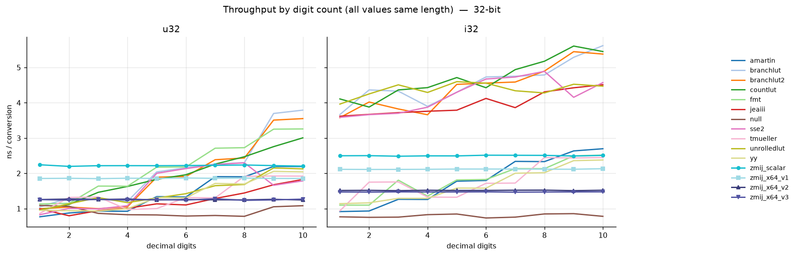
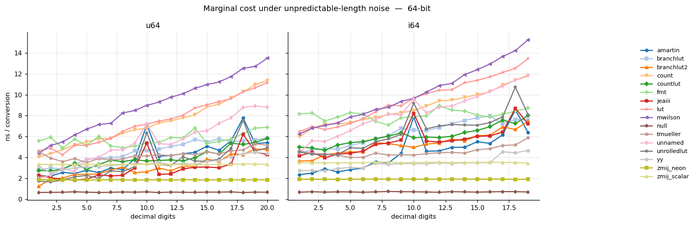
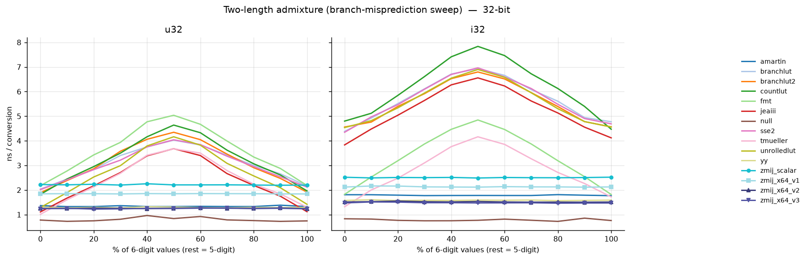
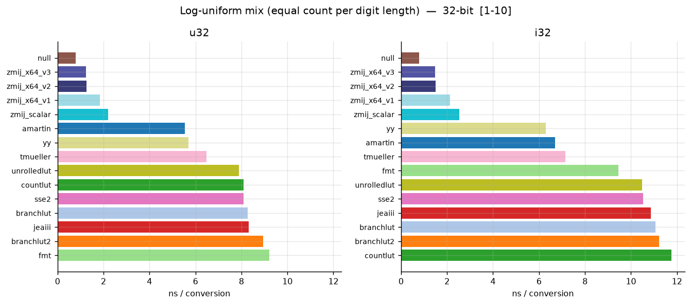
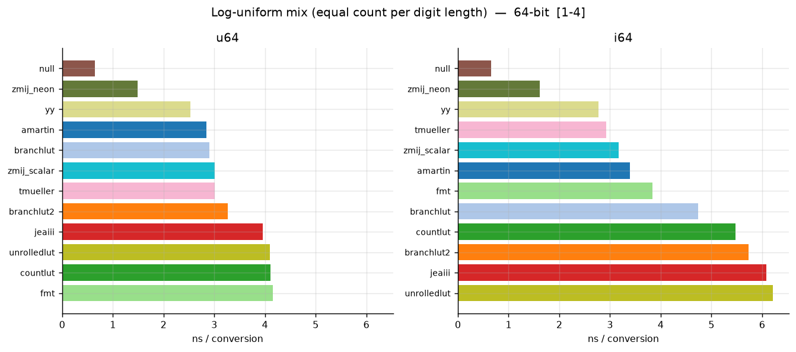
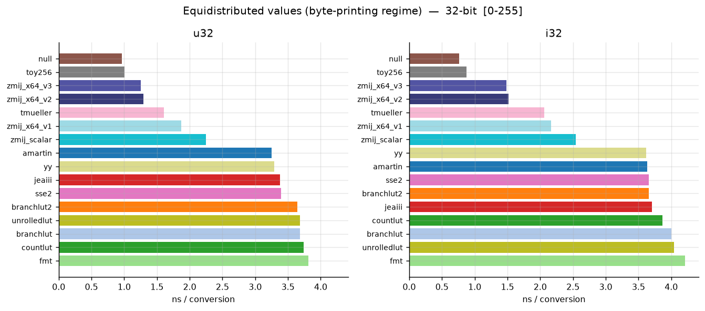
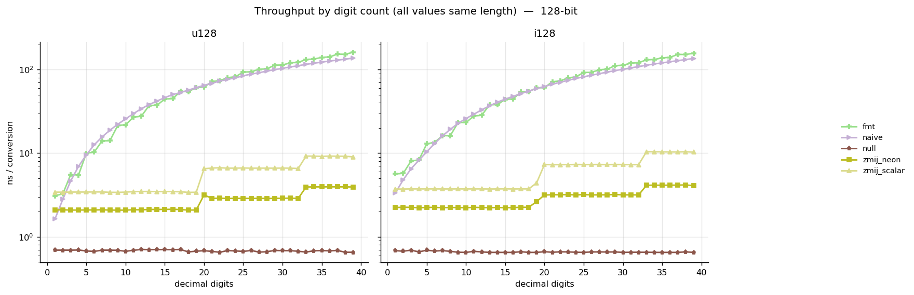

# itoa Benchmark with zmij-based branchfree algorithms

A fork of [Milo Yip's itoa-benchmark](https://github.com/miloyip/itoa-benchmark)
that was used to develop the **branch-free itoa algorithms** based on the BCD
(binary-coded decimal) conversion code found in
[zmij](https://github.com/vitaut/zmij).  These are among the fastest codes,
if not the fastest codes for general purpose integer-to-string conversion.

The code supports both aarch64 using NEON intrinsics and amd64 with specialized
implementations for the microarchitecture levels v1 (SSE2), v2 (SSE4.1), and v3
(AVX2).  We also have a scalar fallback, that uses SWAR[^swar] techniques to
implement the same branch-free techniques.

We will describe some of the new features of this benchmark and why previous
versions of `itoa-benchmark` proved inadequate in the following.  For each
benchmark that we introduce we show a representative sample plot that illustrates
the results.  These are busy plots as we included the full set of algorithms
included in `itoa-benchmark` together with our new ones.  Ours are easy to find
though, as in most cases the cluster near the faster end of the time axis.

We always show the scalar implementation, `zmij_scalar`, and depending on the
system used for each benchmark either `zmij_neon` (test run on an M5 MacBook Pro,
using clang) or the various amd64 microarchitecture levels `zmij_v1` (SSE2),
`zmij_v2` (SSE4.1), and `zmij_v3` (AVX2) (run on an AMD Ryzen CPU which has a
Zen5 core, with g++16).  All plots are available in the [results](result)
subdirectory.

Besides the new algorithms, this fork adds to the original benchmark:

* **Signed integers** (`i32`/`i64`/`i128`) benchmarked in parallel with the
  unsigned ones, so the cost of the sign handling is directly comparable.
* **128-bit integers** (`__int128`), see [below](#128-bit-support).
* **New benchmark modes** that control the digit-length distribution of the
  input — the heart of this fork, explained in the following sections.
* Variable data sample length to study the impact of the large branch
  prediction buffers in CPUs.
* An ABBA/interleaved measurement engine (each implementation is timed over
  the same dataset in alternating roster order, minimum over rounds) to cancel
  turbo/thermal drift.

The full sets of plots, including the 32-bit 64-bit and 128-bit variants of each
mode, are in [result/plots_zen5/](result/plots_zen5/) and [result/plots_m5](result/plots_m5),
respectively.  The Zen5 plots are avaialable from builds with GCC 16 and clang 21.

## The problem: benchmarking with perfect branch prediction

The original version of this benchmark ran an independent measurement for each
length: first a pass over nothing but 1-digit values, then a pass over
2-digit values, and so on. Within each pass every digit-count-related branch
always goes the same way, so the branch prediction is perfect. That is a fine
way to study an algorithm's arithmetic, but it does not reflect the
characteristics of processing realistic data, where the length of the next
number is not known in advance and length-based branches actually miss.

This mode is kept as `bylength`.  It is the predictable best case, and it can
give a lower bound of evaluation time, but no estimate for the performance
under non-pathological realistic workloads.

*Shown: Zen5/gcc16.  Same plot: [Zen5/clang21](result/plots_zen5/clang21/bylength_32.png),
[M5](result/plots_m5/bylength_32.png)*

Even in this case the zmij algorithms are fast enough to be competitive, and
they are the fastest for long digit strings.

## dtolnay's "unpredictable" mode

Dave Tolnay created [a variation of the benchmark](https://github.com/dtolnay/itoa-benchmark)
that added an "unpredictable" mode: half of the benchmark sample consists
of values of varying lengths ("noise"), the other half is of the length
under test, and the benchmark evaluates the marginal cost of the fixed-length
half (measure the combined stream, subtract the noise-only baseline). This
fork implements the same algorithm as the `unpredictable` mode.

The name promises more than it delivers, though. Since the fixed-length acocunts
for half of the test data, more than half of the combined stream
(~55% for 32-bit) has the length under test.   Thus any length-based jump will
actually predict quite well, the predictor simply biases toward the length
under test.  And if an implementation resolves the length through a cascade
of branches, the later jumps predict even better: if each branch divides the
remaining data set in half based on length then the first branch will be 55%
predictable, the second branch 83%, and so on.[^1]  So while this test does
reflect some kinds of data, it is not as unpredictable as it may seem.

*Shown: M5.  Same plot: [Zen5/gcc16](result/plots_zen5/gcc16/unpredictable_64.png),
[Zen5/clang21](result/plots_zen5/clang21/unpredictable_64.png)*

In spite of these caveats, zmij carves out a win.

## Admixture: measuring the cost of a mispredicted jump

To demonstrate the effect of branch prediction directly, this fork adds the
`admixture` mode: the input is a random mix of just two fixed lengths
(default 5 and 6 digits), and the mixing ratio is swept from 0% to 100%. The
pure ends predict perfectly; a 50/50 mix maximizes mispredictions on any
branch separating the two lengths:

*Shown: Zen5/gcc16.  Same plot: [Zen5/clang21](result/plots_zen5/clang21/admixture_32_5x6.png),
[M5](result/plots_m5/admixture_32_5x6.png)*

Two things stand out:

* The zmij variants are flat, as expected — they have no length branches.
  But amartin and yy, while branchy, are flat too: unlike the other
  algorithms they happen to treat 5- and 6-digit numbers in the same
  branch, so this particular pair never makes them jump. (A pair that
  straddles one of their branch boundaries would produce the same hump —
  `--admix` lets you choose the pair.)
* For the algorithms that do branch between 5 and 6 digits the impact is
  clear: at 50% probability they lose on average 3.5ns, i.e. 7ns per
  mispredicted jump.  On the M5 (not shown), the loss per jump is approximately
  8ns.

The branch prediction in CPUs relies on memorizing the jump sequences taken
by the code.  For too small data sets even these random sets of data are
perfectly predicted on repetition.  After some experimenting, we chose a
default benchmark size of 65536 samples, where little predictability effects
remain but the test data still fits in L3 cache.

## Log-uniform: another random mix

As an alternative to `unpredictable`, the `loguniform` mode benchmarks a
shuffled set with an equal number of values in each digit-length bin
(uniform in the number of digits, i.e. uniform in `floor(log10(value))`),
over a configurable window of lengths. No length dominates, so no length-based
branch gets to be well-predicted.  Instead of scanning over the number of
digits this amortizes over the whole range of lengths tested.

*Shown: Zen5/gcc16.  Same plot: [Zen5/clang21](result/plots_zen5/clang21/loguniform_32_1_10.png),
[M5](result/plots_m5/loguniform_32_1_10.png)*

Every zmij variant — including the scalar, non-SIMD one — beats every branchy
implementation, and it does so by a distance.  Numbers that span the
whole range are probably seldom enough to dimiss this as artificial, so we
also show the restriction to numbers with one to four digits.

*Shown: M5.  Same plot: [Zen5/gcc16](result/plots_zen5/gcc16/loguniform_64_1_4.png),
[Zen5/clang21](result/plots_zen5/clang21/loguniform_64_1_4.png)*

Again, zmij is at the top.  In the case where a 64 bit integer between one
and four digits is input (not shown), `tmueller` and `yy` beat the zmij's
`scalar` fallback algorithms, but the SIMD variants come out at top.

## Byte serialization

Finally, as a fun exercise — but a not-so-rare use case — the `uniform` mode
benchmarks values equidistributed in a small range, by default 0–255: the
"printing bytes as decimal" regime (think serializing raw byte arrays or
writing `PPM` image files).  The distribution is uniform over values rather
than lengths, so three-digit numbers dominate.  We also added the `toy256`
algorithm for this case, a specialized converter that takes an integer,
and then looks up the string corresponding to its lowest eight bits in a 256
entry table.  This algorithm is so fast that in the benchmark run used to
create the plots it actually beat the do-nothing (`null`) version.

*Shown: Zen5/gcc16.  Same plot: [Zen5/clang21](result/plots_zen5/clang21/uniform_32_0_255.png),
[M5](result/plots_m5/uniform_32_0_255.png)*

Of the general algorithms again zmij comes out at top.  The `tmueller`
algorithm beats the v1 (SSE2) version, but even the fallback `zmij_scalar`
beats everything else.

## 128-bit support

The benchmark also covers `unsigned __int128` / `__int128`. There is no
standard formatter for these, so [{fmt}](https://github.com/fmtlib/fmt)
(`fmt::format_to`) serves as the reference; most implementations in the
roster do not provide 128-bit conversion and are skipped for that width:

*Shown: M5.  Same plot: [Zen5/gcc16](result/plots_zen5/gcc16/bylength_128.png),
[Zen5/clang21](result/plots_zen5/clang21/bylength_128.png)*

For 128-bit types the admixture mode gains extra sweeps (`straddle64`,
`straddle1e32`) that mix values just below and just above zmij's internal
thresholds (2^64 delegation to the 64-bit path, and the 10^32 chunk-count
boundary).

## Build and Run

Requirements: CMake ≥ 3.20, a C++14 compiler, and network access on first
configure (CMake fetches {fmt} via `FetchContent`). Presets are provided for
`g++-16` (default) and `clang++-21`.

~~~~~~~~sh
make                       # build + run + plot with g++-16
make PRESET=clang21        # same, with clang++-21
make plots                 # regenerate PNGs from the CSV
~~~~~~~~

Or drive CMake directly: 

~~~~~~~~sh
cmake --preset gcc16
cmake --build build/gcc16 -j
./build/gcc16/itoa                              # see --help for options
~~~~~~~~

Useful driver options (`itoa --help`):

~~~~~~~~
--modes=bylength,loguniform,unpredictable,admixture,uniform
--types=u32,i32,u64,i64,u128,i128
--filter=sse2,jeaiii,fmt        substring match (comma = OR)
--admix=5,6;9,10                digit-length pairs for the admixture sweep
--admix-step=10                 percentage step of the sweep
--loguniform=1-10,1-20          length windows
--uniform=0-255                 equidistributed value range
--size=65536 --rounds=6 --passes=1048576
~~~~~~~~

## Credits

* [Milo Yip's original itoa-benchmark](https://github.com/miloyip/itoa-benchmark):
  benchmark framework and most of the implementations in the roster (see
  the original readme for descriptions of the individual algorithms).
* [dtolnay's Rust variation](https://github.com/dtolnay/itoa-benchmark): the
  unpredictable-mode algorithm.
* [zmij](https://github.com/vitaut/zmij): the BCD conversion codes that were
  adapted for the `zmij-*` algorithms in this benchmark.

[^swar]: SWAR = SIMD Within A Register, a technique to process multiple
data items simultaneously without using SIMD (Single Instruction Multiple
Data) operations.

[^1]: If we are using ten bins of data, then the `unpredictable`
benchmark will distribute the data such that the bin under test contains
55% of the data and the other bins 5% each.  If we assume for simplicity
a jump cascade that excludes half the range at each step, then in the first
step, 75% of the data will lie on the side where the test data is found, and
25% will lie on the other side.  So this jump will be predicted correctly
75% of the time.  The 25% on the other side remain equidistributed and
unpredictable, but on the side where we are testing, the data are distributed
unevenly.  We have five bins.  Four contain 5% of the total data, and one
contains 55%.  In the next step we again divide into two equal groups (which
is not possible based on digit counts, but we ignore that for the sake of
argument).  On one side of the dividing line we have 5×5% / 2 = 12.5% of
the data, on the other side 50% + 5×5% / 2 = 62.5%.  A branch choosing between
these will be predicted correctly 62.5% / 75% = 83% of the time.  And so on.
